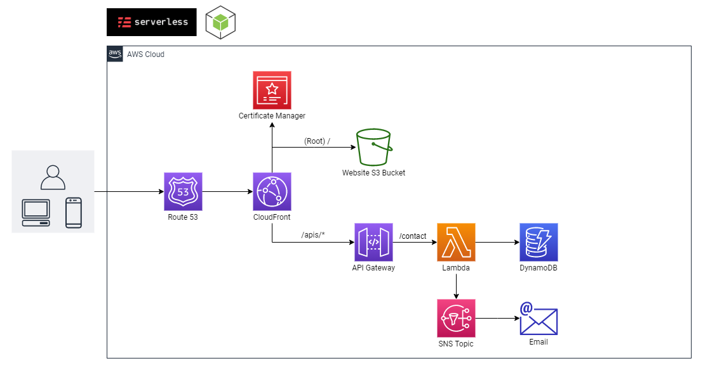

# How to deploy a fully serverless portfolio website on AWS

## Architecture

Let me explain which AWS service is used for which purposes in the above architecture.

- **Route 53:** It is used to manage your domain name.
- **CloudFront:** It is used to catch static content at AWS's edge location, increasing your website's response time.
Certificate Manager: It is used to manage your custom SSL certificate for CloudFront distribution.
- **S3 Bucket:** It is used to deploy your static portfolio website.
- **API Gateway:** It is used to create API to communicate with backend services.
- **Lambda:** It is used to implement core logic to store contact data in the database and send messages to notification service when contact arrives.
- **SNS Topic:** It is used to send messages to you, which are consumed from the lambda function.

> **_Note:_**
In this project, we will use Serverless Framework to reserve our resources on AWS as I have explained above, so if you are having any question regarding any properties in template file then just search like `cloudformation <service-name>` and refer the cloudformation documentation for those services.

---
### For the `Pre-requisites`, `Implementation` and `Clean` visit the below my blog post:

https://enlear.academy/deploy-a-serverless-portfolio-website-on-aws-d6bc5c2adeca